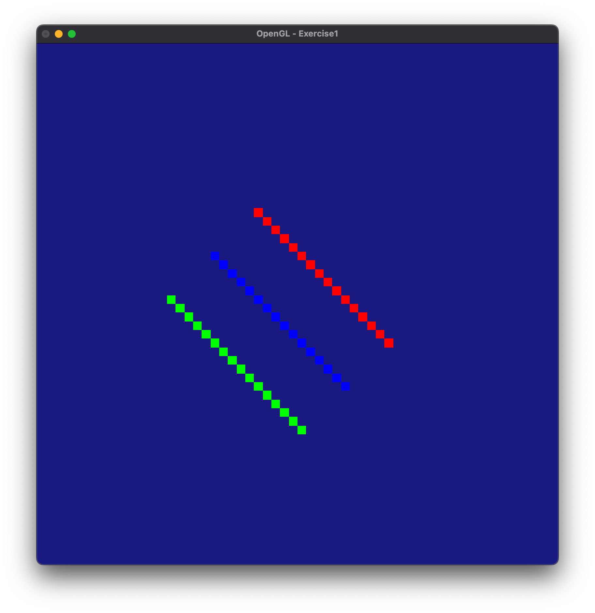
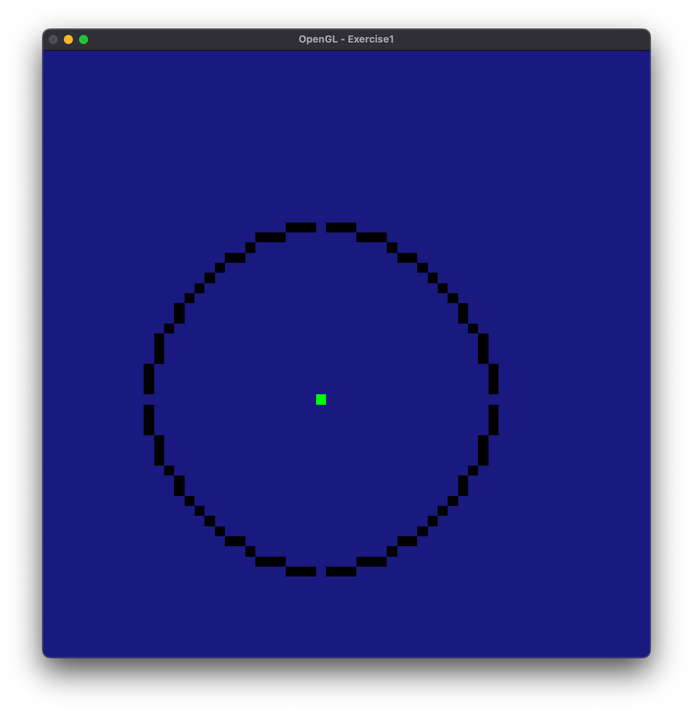

# OpGL_Exercise
Open GL exercises from a school project - Computer Graphics.
Implementing various project using OpenGL in C++

### Setup
* OpenGL is deprecated on newer MacOS so it might not work on yours.
* Xcode ––> Project Settings ––> Targets 
* Add 2 Frameworks for this to build & run
* OpenGL & GLUT Framework

Before doing these exercise learn how Bresenham algorith works! 
https://youtu.be/vlZFSzCIwoc
Also learn how double buffer works in OpenGL
https://youtu.be/g9AnCgpBWUk

#### Exercise 1
* Implement a Bresenham algorithm to draw a line
* The result should draw pixelated (staircase) 3 lines with different colors

#### Exercise 2
* Implement a Bresengam algorith to draw a circle
* The result should draw a pixelated circle. 
* *I should fix the bug where theres pixel missing for each section not being drawn?*

#### Exercise 3
* Implement a visualization of an animated solar system. 
* The result should rotate the planets around the sun.
